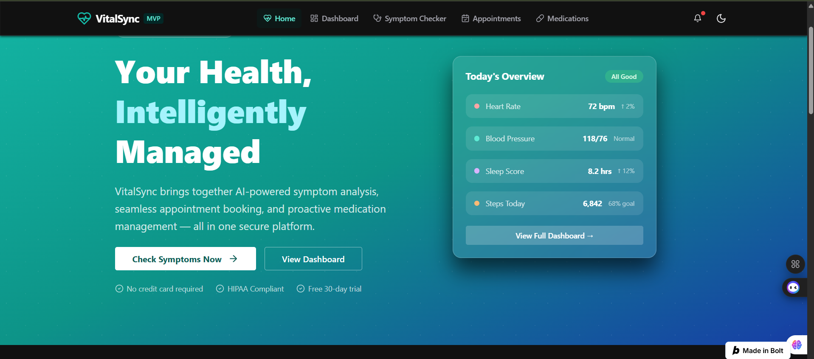
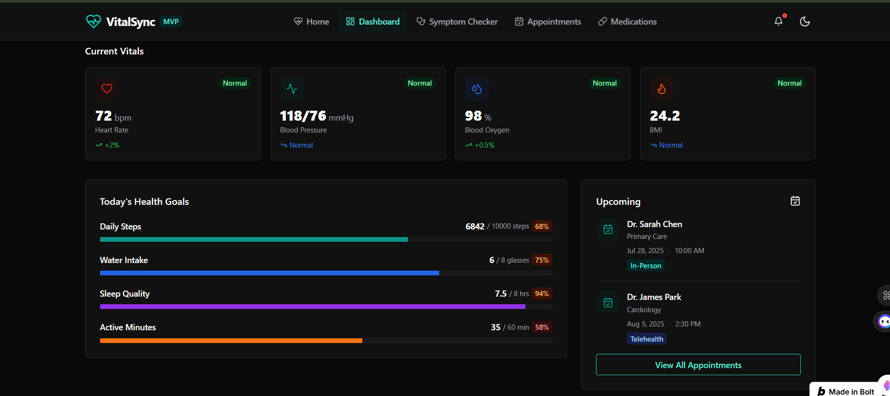
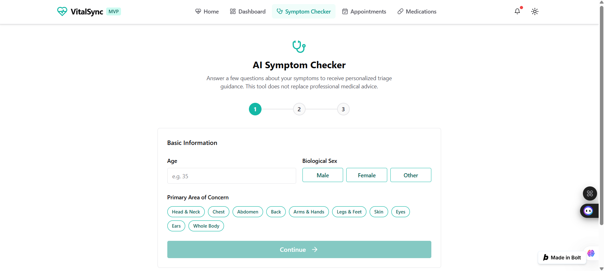
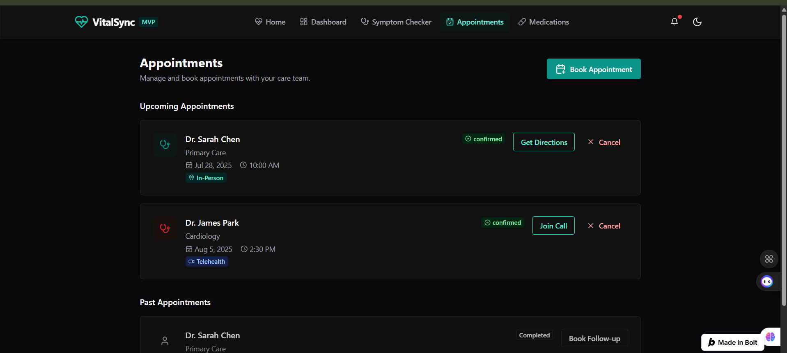
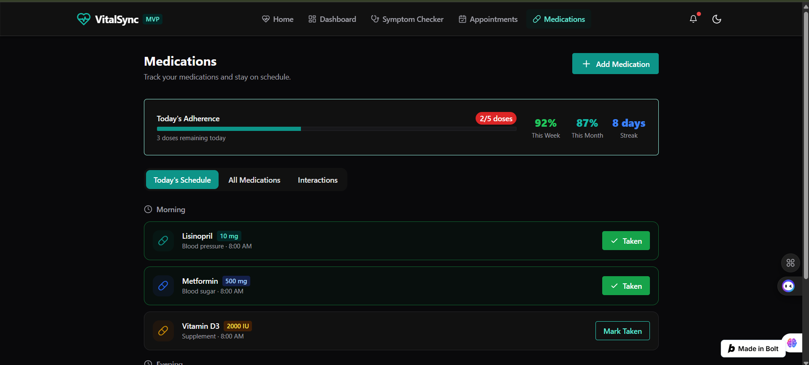

<div align="center">


# 🩺 VitalSync AI

### AI-Powered Smart Healthcare Platform

**Your Health. Smarter. Faster. Safer.**

🌐 **Live Demo:** https://healthcare-web-app-m-t3lw.bolt.host/

</div>

---

# 📖 About

VitalSync AI is an AI-powered healthcare web application that brings symptom checking, appointment booking, medication management, and health tracking into one modern platform.

Designed as a production-ready MVP, the application focuses on delivering a seamless healthcare experience through an intuitive interface, intelligent recommendations, and responsive design.

---

# 📸 Project Screenshots

## 🏠 Home Page
 ## 📊 Health Dashboard 

## 🤖 AI Symptoms Checker

 ## 📅 Appointment Booking   |

## 💊 Medication Tracker
  |

# ✨ Features

### 🤖 AI Symptom Checker

* Multi-step symptom assessment
* AI-powered health triage
* Emergency detection
* Personalized recommendations
* Possible health conditions
* Medical disclaimer

### ❤️ Health Dashboard

* Heart Rate Monitoring
* Blood Pressure Tracking
* Blood Oxygen Monitoring
* BMI Calculation
* Daily Goals
* Weekly Progress Charts
* Health Alerts

### 📅 Appointment Booking

* Doctor Directory
* Ratings & Reviews
* Telehealth Booking
* In-Person Appointments
* Time Slot Selection
* Booking Confirmation

### 💊 Medication Tracker

* Daily Medication Schedule
* Mark Medicines as Taken
* Adherence Tracking
* Refill Reminders
* Drug Interaction Checker
* Medication History

### 🎨 Modern User Experience

* Responsive Design
* Light & Dark Theme
* Smooth Animations
* Mobile Friendly
* Fast Navigation

---

# 🛠️ Tech Stack

| Category   | Technology           |
| ---------- | -------------------- |
| Frontend   | React 19             |
| Language   | TypeScript           |
| UI Library | Chakra UI v3         |
| Styling    | Chakra UI + Emotion  |
| Icons      | Lucide + React Icons |
| Charts     | Recharts             |
| Theme      | next-themes          |
| Build Tool | Vite                 |
| Deployment | Bolt / Vercel        |

---

# 📁 Project Structure

```text
VitalSync-AI/
│
├── public/
├── screenshots/
├── src/
│   ├── components/
│   ├── pages/
│   ├── hooks/
│   ├── utils/
│   ├── App.tsx
│   └── main.tsx
│
├── package.json
├── vite.config.ts
└── README.md
```

---

# 🚀 Getting Started

## Clone Repository

```bash
git clone https://github.com/rj25baria/vitalsync-ai.git
```

## Install Dependencies

```bash
npm install
```

## Start Development Server

```bash
npm run dev
```

Visit:

```
http://localhost:5173
```

---

# 📦 Build for Production

```bash
npm run build
```

Preview the production build:

```bash
npm run preview
```

---

# 🛣️ Roadmap

* User Authentication
* Cloud Database
* Wearable Integration
* AI Health Assistant
* Video Consultation
* Doctor Dashboard
* Health Reports
* Notifications
* Subscription Plans

---

# 🤝 Contributing

Contributions are welcome!

1. Fork the repository
2. Create a new branch
3. Commit your changes
4. Push your branch
5. Open a Pull Request

---

# 📄 License

This project is licensed under the MIT License.

Made with ❤️ to create smarter healthcare experiences.

**If you found this project helpful, consider giving it a ⭐ on GitHub!**
